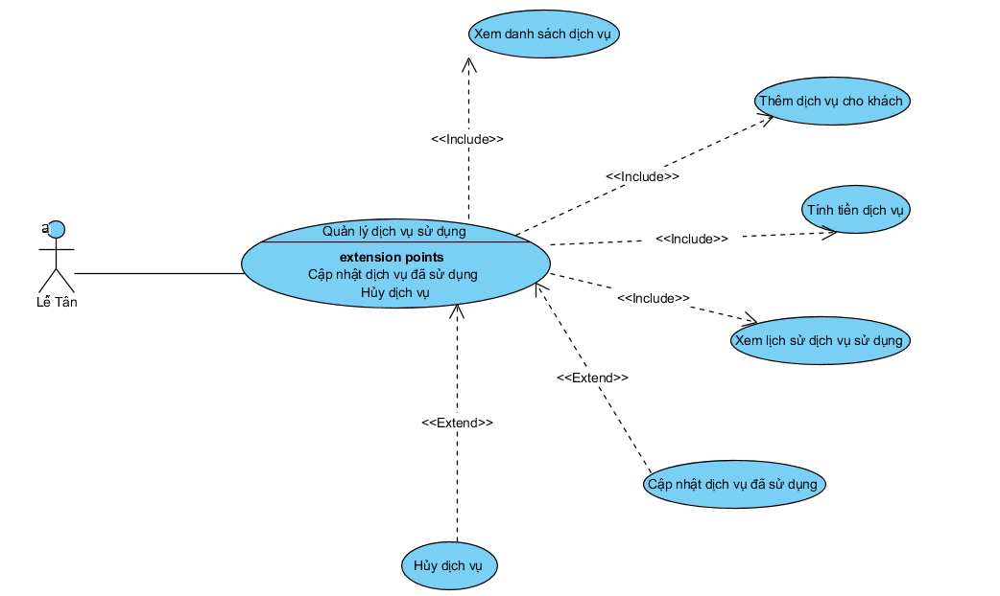

| Thuộc tính       | Mô tả                                                                                                                                                                                                                                                                                                                                                                                                                                                                                                                                                                                                                                                                                                                                                                                                                                                                                                                                                                                                                                                                     |
| ------------------ | --------------------------------------------------------------------------------------------------------------------------------------------------------------------------------------------------------------------------------------------------------------------------------------------------------------------------------------------------------------------------------------------------------------------------------------------------------------------------------------------------------------------------------------------------------------------------------------------------------------------------------------------------------------------------------------------------------------------------------------------------------------------------------------------------------------------------------------------------------------------------------------------------------------------------------------------------------------------------------------------------------------------------------------------------------------------------- |
| Tên chức năng   | Xem báo cáo – thống kê doanh thu                                                                                                                                                                                                                                                                                                                                                                                                                                                                                                                                                                                                                                                                                                                                                                                                                                                                                                                                                                                                                                       |
| Tác nhân         | Admin                                                                                                                                                                                                                                                                                                                                                                                                                                                                                                                                                                                                                                                                                                                                                                                                                                                                                                                                                                                                                                                                       |
| Mô tả            | Chức năng cho phép kế toán hoặc admin xem, thống kê và xuất báo cáo doanh thu của khách sạn theo thời gian                                                                                                                                                                                                                                                                                                                                                                                                                                                                                                                                                                                                                                                                                                                                                                                                                                                                                                                                                  |
| Tiền điệu kiện | - Người dùng đã đăng nhập hệ thống - Có quyền admin                                                                                                                                                                                                                                                                                                                                                                                                                                                                                                                                                                                                                                                                                                                                                                                                                                                                                                                                                                                                      |
| Hậu điều kiện  | - Báo cáo doanh thu được hiển thị - Có thể xuất báo cáo (PDF/Excel) nếu người dùng yêu cầu                                                                                                                                                                                                                                                                                                                                                                                                                                                                                                                                                                                                                                                                                                                                                                                                                                                                                                                                                         |
| Kịch bản chính  | -  Addmin chọn chức năng Xem báo cáo – thống kê doanh thu - Hệ thống hiển thị giao diện chọn tiêu chí thống kê (thời gian: ngày/tháng/ - Addmin nhập thời gian cần thống kê - Addmin nhấn Xem báo cáo  - Hệ thống kiểm tra dữ liệu đầu vào - Hệ thống truy vấn dữ liệu doanh thu từ CSDL  - Hệ thống tổng hợp và xử lý dữ liệu - Hệ thống hiển thị báo cáo doanh thu (bảng số liệu / biểu đồ) - Addmin kết thúc chức năng hoặc chọn xuất báo cáo - Người dùng đã đăng nhập hệ thống - Có quyền kế toán hoặc admin-                                                                                                                                                                                                                                                                                                                                                                                               |
| Kích bản phụ    | * Trường hợp A: Chưa chọn thời gian thống kê - Ở bước 3: Người dùng không chọn hoặc chọn thiếu thời gian - Hệ thống hiển thị thông báo lỗi + “Vui lòng chọn thời gian thống kê” - Yêu cầu người dùng nhập lại - Quay lại bước 3 * Trường hợp B: Không có dữ liệu doanh thu - Ở bước 6: Hệ thống không tìm thấy dữ liệu phù hợp - Hệ thống hiển thị thông báo + “Không có dữ liệu doanh thu trong khoảng thời gian đã chọn” - Quay lại bước 2 * Trường hợp C: Xuất báo cáo - Sau bước 8: Người dùng chọn Xuất báo cáo - Hệ thống hiển thị lựa chọn định dạng (PDF / Excel) - Người dùng chọn định dạng - Hệ thống tạo và tải file báo cáo về máy  * Trường hợp D: Người dùng không có quyền - Người dùng không thuộc vai trò Admin - Hệ thống thông báo + “Bạn không có quyền truy cập chức năng này” |

4. Biểu đồ Sub Quản lý hóa đơn

|       Thuộc tính | Mô tả                                                                                                                                                                            |
| -----------------: | ---------------------------------------------------------------------------------------------------------------------------------------------------------------------------------- |
|   Tên chức năng | Quản lý hóa đơn                                                                                                                                                               |
|         Tác nhân | Kế toán                                                                                                                                                                          |
|            Mô tả | Chức năng cho phép kế toán tạo, xem, cập nhật, xóa hóa đơn và xác nhận thanh toán cho khách hàng sau khi sử dụng dịch vụ khách sạn.                        |
| Tiền điều kiện | - Kế toán đã đăng nhập hệ thống - Khách hàng đã check-out - Có dữ liệu phòng và dịch vụ đã sử dụng                                            |
|  Hậu điều kiện | - Hóa đơn được tạo/cập nhật/xóa đúng quy định - Hóa đơn được lưu trong CSDL - Hóa đơn đã thanh toán được dùng cho thống kê doanh thu |

5. Biểu đồ Sub Xuất báo cáo tài chính

| Thuộc tính       | Mô tả                                                                                                                                                             |
| ------------------ | ------------------------------------------------------------------------------------------------------------------------------------------------------------------- |
| Tên chức năng   | Xuất báo cáo tài chính                                                                                                                                         |
| Tác nhân         | Kế toán                                                                                                                                                           |
| Mô tả            | Chức năng cho phép kế toán xuất báo cáo tài chính của khách sạn (doanh thu, chi tiết theo thời gian) ra file để lưu trữ hoặc in ấn.            |
| Tiền điều kiện | - Kế toán đã đăng nhập hệ thống - Đã có dữ liệu thống kê doanh thu - Có ít nhất một hóa đơn đã được xác nhận thanh toán |
| Hậu điều kiện  | - Báo cáo tài chính được xuất thành công (PDF/Excel) - Dữ liệu báo cáo phản ánh đúng doanh thu trong CSDL                                  |

| Thuộc tính       | Mô tả                                                                                                                                                                                                                                                                                                                                                                                                           |
| ------------------ | ----------------------------------------------------------------------------------------------------------------------------------------------------------------------------------------------------------------------------------------------------------------------------------------------------------------------------------------------------------------------------------------------------------------- |
| Tên chức năng   | Quản lý dịch vụ sử dụng                                                                                                                                                                                                                                                                                                                                                                                     |
| Tác nhân         | Lễ Tân                                                                                                                                                                                                                                                                                                                                                                                                          |
| Mô tả            | Chức năng cho phép lễ tân quản lý các dịch vụ mà khách hàng sử dụng trong thời gian lưu trú, bao gồm thêm mới, cập nhật, hủy dịch vụ và tính tiền dịch vụ vào hóa đơn                                                                                                                                                                                                          |
| Tiền điều kiện | - Lễ tân đã đăng nhập hệ thống - Khách hàng đang thuê phòng - Danh sách dịch vụ đã được khai báo trong hệ thống                                                                                                                                                                                                                                                             |
| Hậu điều kiện  | - Thông tin dịch vụ sử dụng được lưu vào CSDL - Chi phí dịch vụ được cập nhật chính xác vào hóa đơn của khách                                                                                                                                                                                                                                                                    |
| Luồng chính      | 1. Lễ tân chọn chức năng quản lý dịch vụ sử dụng 2. Hệ thống hiển thị danh sách phòng/khách đang lưu trú 3. Lễ tân chọn phòng hoặc khách hàng 4. Hệ thống hiển thị danh sách dịch vụ 5. Lễ tân chọn dịch vụ và nhập số lượng, thời gian sử dụng 6. Lễ tân xác nhận 7.Hệ thống tính tiền và lưu thông tin dịch vụ |
|                    |                                                                                                                                                                                                                                                                                                                                                                                                                   |

| Thuộc tính       | Mô tả                                                                                                                                                                                                                                                                                                                                                                                        |
| ------------------ | ---------------------------------------------------------------------------------------------------------------------------------------------------------------------------------------------------------------------------------------------------------------------------------------------------------------------------------------------------------------------------------------------- |
| Tên chức năng   | Quản lý tình trạng phòng                                                                                                                                                                                                                                                                                                                                                                  |
| Tác nhân         | Lễ tân                                                                                                                                                                                                                                                                                                                                                                                       |
| Mô tả            | Chức năng cho phép lễ tân theo dõi và cập nhật tình trạng các phòng trong khách sạn như: phòng trống, phòng đã đặt, phòng đang sử dụng, phòng đang dọn dẹp hoặc bảo trì                                                                                                                                                                                      |
| Tiền điều kiện | - Lễ tân đã đăng nhập hệ thống - Danh sách phòng đã được tạo trong hệ thống                                                                                                                                                                                                                                                                                          |
| Hậu điều kiện  | - Tình trạng phòng được cập nhật chính xác trong CSDL - Thông tin tình trạng phòng được phản ánh đúng trên hệ thống                                                                                                                                                                                                                                             |
| Luồng chính      | 1. Lễ tân chọn chức năng quản lý tình trạng phòng 2. Hệ thống hiển thị danh sách phòng và trạng thái hiện tại 3. Lễ tân chọn phòng cần cập nhật 4. Lễ tân thay đổi tình trạng phòng (trống/đã đặt/đang sử dụng/dọn dẹp/bảo trì) 5. Lễ tân xác nhận cập nhật 6.Hệ thống lưu thông tin tình trạng phòng |

