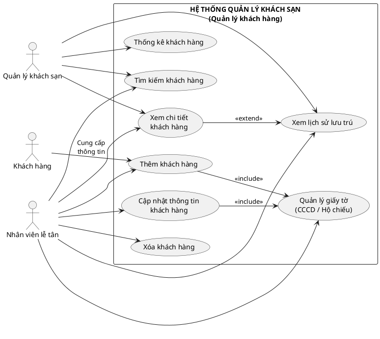

| Thuộc tính               | Mô tả                                                                                                                                                                                                                          |
| -------------------------- | -------------------------------------------------------------------------------------------------------------------------------------------------------------------------------------------------------------------------------- |
| Tên chức năng           | Quản lý khác hàng                                                                                                                                                                                                            |
| Actor chính               | Nhân viên lễ tân                                                                                                                                                                                                             |
| Actor phụ                 | Quản lý khách sạn, Khách hàng                                                                                                                                                                                              |
| Mô tả                    | Quản lý thông tin cá nhân và lịch sử lưu trú của khách hàng để phục vụ đặt phòng, thanh toán và báo cáo                                                                                                  |
| Tiền điều kiện         | Nhân viên lễ tân hoặc quản lý đã đăng nhập hệ thống; hệ thống và cơ sở dữ liệu hoạt động bình thường                                                                                                  |
| Hậu điều kiện          | Thông tin khách hàng được lưu trữ trong CSDL; dữ liệu sẵn sàng dùng cho đặt phòng, thanh toán và báo cáo                                                                                                     |
| Kịch bản chính          | 1. Chọn chức năng quản lý khách hàng 2. Hệ thống hiển thị danh sách khách hàng 3. Thêm / Cập nhật / Xóa / Tìm kiếm khách hàng 4. Hệ thống xử lý yêu cầu 5. Thông báo kết quả |
| Kịch bản phụ            | A1 - Khách hàng đã tồn tại - Hệ thống phát hiện trùng CCCD/Hộ chiếu - Thông báo khách hàng đã tồn tại                                                                                           |
| Luồng sự kiện thay thế | A1 - Khách hàng đã tồn tại - Hệ thống phát hiện trùng CCCD/Hộ chiếu - Thông báo khách hàng đã tồn tại - Cho phép cập nhật thông ti                                                       |
