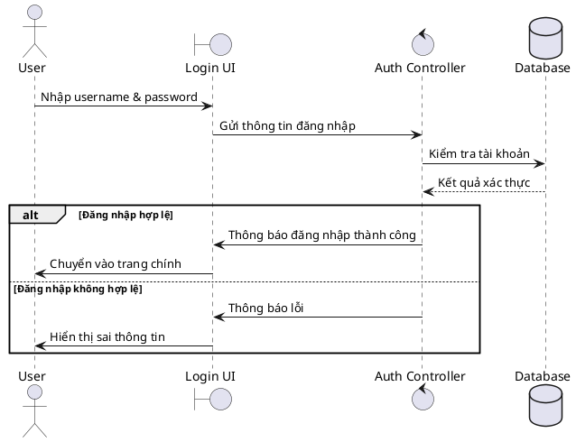

| Thuộc tính       | Mô tả                                                                                                                                                                                                                                                                                                                                                                                |
| ------------------ | -------------------------------------------------------------------------------------------------------------------------------------------------------------------------------------------------------------------------------------------------------------------------------------------------------------------------------------------------------------------------------------- |
| Tên chức năng   | Đăng nhập hệ thống                                                                                                                                                                                                                                                                                                                                                                |
| Actor              | Người dùng( Lễ tân, khách hàng, quản lý)                                                                                                                                                                                                                                                                                                                                      |
| Mô tả            | Chức năng cho phép người dùng (quản lý, lễ tân, nhân viên) đăng nhập vào hệ thống quản lý khách sạn bằng tài khoản và mật khẩu đã được cấp, nhằm truy cập các chức năng phù hợp với quyền hạn.                                                                                                                                             |
| Tiền điều kiện | - Người dùng có tài khoản trong hệ thống - Hệ thống đang hoạt động bình thường - Người dùng đang ở màn hình đăng nhập                                                                                                                                                                                                                             |
| Hậu điều kiện  | - Nếu đăng nhập thành công:   Người dùng được chuyển vào trang chính của hệ thống - Nếu đăng nhập thất bại:   Hệ thống báo lỗi và người dùng vẫn ở màn hình đăng nhập                                                                                                                                                          |
| Kịch bản chính  | 1. Người dùng nhập username và password 2. Hệ thống gửi thông tin đăng nhập đến Auth Controller 3. Auth Controller kiểm tra thông tin tài khoản trong cơ sở dữ liệu 4. Cơ sở dữ liệu trả về kết quả xác thực 5. Hệ thống thông báo đăng nhập thành công 6. Hệ thống chuyển người dùng vào trang chính |
| Kịch bản phụ    | Đăng nhập không hợp lệ: 1. Hệ thống thông báo lỗi đăng nhập 2. Hệ thống hiển thị thông báo sai thông tin đăng nhập                                                                                                                                                                                                                                 |
